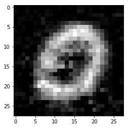

# Deceiver-neural-network
Project for the ML course at Roma Tre University

## Introduction

This is a method to easily craft adversarial samples against a "black box" neural network.
The goal is to train a neural network `ADV` so as that it can produce slightly perturbated versions of legitimate inputs that are misclassified by a target DNN: `TRG`. These inputs should be as similar as possible to valid inputs so that a human would not detect the tampering attempt. 

## How it works
Here is a brief explaination of how it works.
`TRG` is a DNN trained to classify a MNIST image `x` as belonging to its *true class*: `Y(x)`. Therefore, most of the times `TRG(x) = Y(x)`. We train a DNN `ADV` so that given a label `lbl` (a number between 0 and 9), it produces a 28x28 image `img` which closely resambles an image that a human would classify as `lbl` but that is classified as `fakeLbl = TRG(img)` by `TRG`. `fakeLbl` can be chosen by the adversary and can be different from `lbl`.

For instance if the input of `ADV` is 0 it will produce the following image

Even though it actually resambles a 0, it will be classified as a 9 by `TRG`.

## Training
`TRG` is a trained DNN that can be used as an oracle: given a certain image it produces the corresponding label: the digit displayed in the image.

We concatenate `ADV` with `TRG` thus creating a neural network called `ADV | TRG`. This new neural network is trained as follows:

Let `train` be a set of `(lbl, image, fakeLbl)` tuples. 
`lbl` is a label (a number between 0  and 9), `image` is the image corresponding to `lbl` and `fakeLbl` is the label that `TRG` should assign to `ADV(lbl)`, being `ADV(lbl)`  an image very similar to `image`.
For each `(lbl, image, fakeLbl)` in `train`, `ADV` has to produce a 28x28 image which is as similar as possible to `image` but is classified as `fakeLbl` by `TRG` .

Since `TRG` is just an oracle, its weights won't be altered. Instead, `ADV`'s weights will be adjusted to successfully create adversarial samples.
For instance, if one of the tuples was (0, <an image of a 0>, 9),  when `ADV` is provided with a 0 it will produce an image that closely resambles a 0 but that will be hopefully classified as a 9 by `TRG`.

## Results

Our neural network was tested against the [tensorflow mnist tutorial DNN](https://www.tensorflow.org/versions/r1.1/get_started/mnist/pros) (which is `TRG`). Here are some outputs from  `ADV`:

.png)

Classified as a 7 by `TRG`

.png)

Classified as a 4 by `TRG`

Classified as a 9 by `TRG`

Sergio Adriano Londei
Damiano Massarelli
